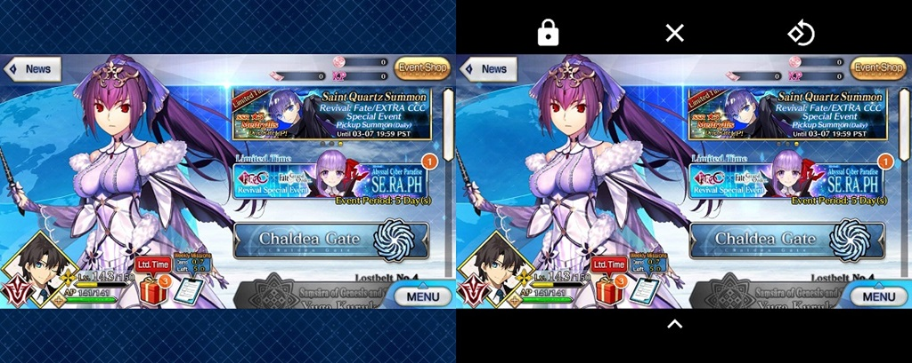
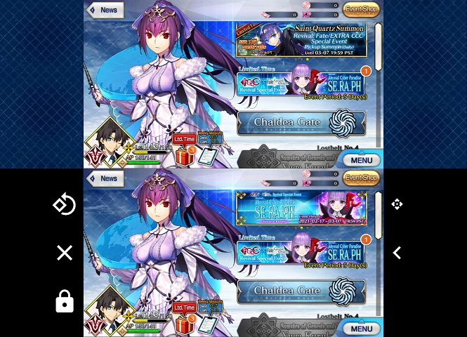
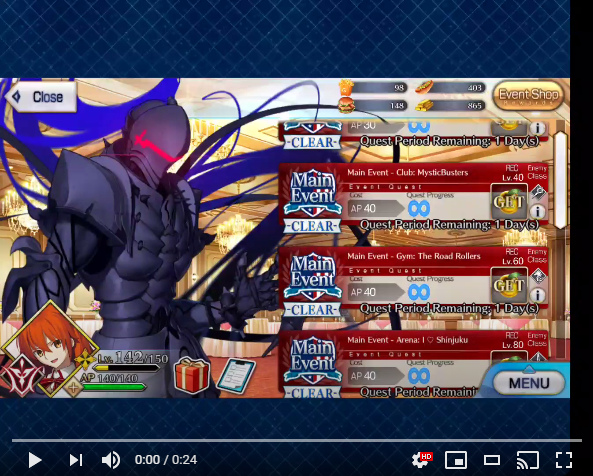
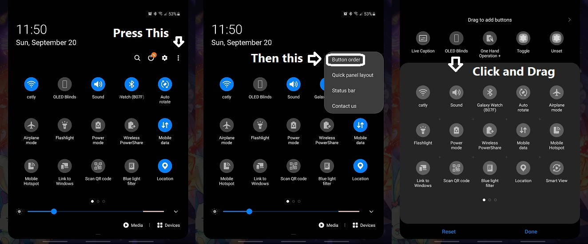

# OLED Blinds

Android Devices have varying screen sizes. That's why you often see static backdrops to maintain the app's aspect ratio. This can damage the screen permanently if this is an app you frequently use for hours.

This app helps by adding black letter boxings which for OLED screen means the pixels will be shut off. The controls hide automatically after a few secs. An unintended side effect of this is that it can save a bit of your battery!

You can set a toggle in the notification/quick panel or turn it on from the app directly. The height or width of the bars is automatically saved. In case the controls become inaccessible, there is a reset button in the app.

This app needs permission to Draw Over Other Apps.
## Demo Video:

## Requirements:
* Android 8.0 and up.
* Permission to Draw Over Other Apps.

## How To Get:
* [Get it for free here](https://github.com/catly1/OledBlinds/releases)
* [Play store ($0.99)](https://play.google.com/store/apps/details?id=com.catly.oledsaver)

Both links have the same app. If you want to support my work then consider buying it from the app store.

## Installation:
* After downloading app-release.apk, simply run it.
* Follow the steps on the app.
* Adding it in the notification panel varies between devices. If you have a Samsung phone follow this guide:

## Disclaimer:
This app does not directly interact with other apps. It just draws black bars on the screen. It's the same as how Facebook messenger draws floating chat heads.