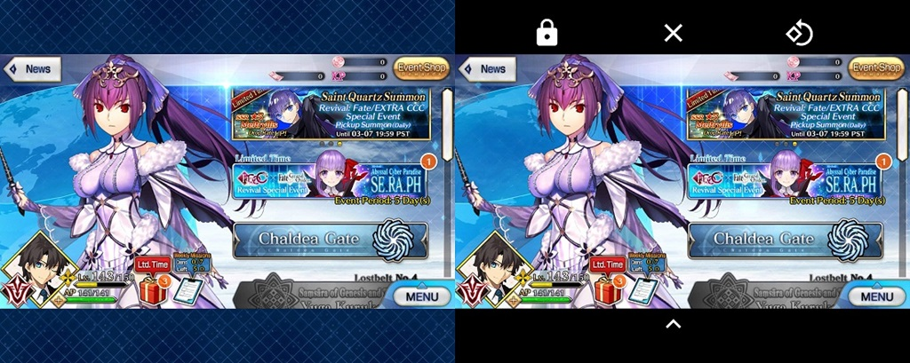
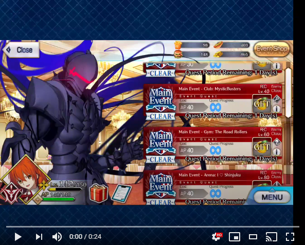
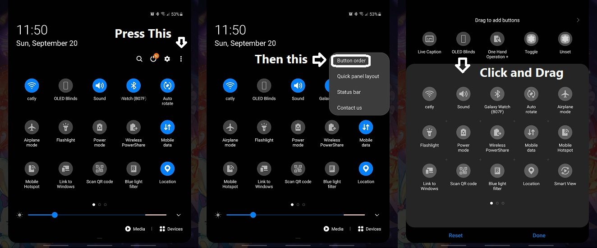

# LetterBoxer (formerly OLEDBlinds)

Android Devices have varying screen sizes. That's why you often see static backdrops to maintain the app's aspect ratio. 

This app adds black letter boxings. The controls hide automatically after a few secs and can be locked.

You can set a toggle in the notification/quick panel or turn it on from the app directly. The height or width of the bars is automatically saved. In case the controls become inaccessible, there is a reset button in the app.

This app needs permission to Draw Over Other Apps.

## Bar Opacity:
Settings has an opacity slider. At 100% the bars are solid black (the default, best for OLED burn-in).
Lower it to let the app underneath show through. It bottoms out at 10% so the bars never become
invisible while still sitting on the screen.

## Custom Zones:
Letter boxing only covers the edges. Static controls in the middle of the screen -- TikTok's column of
like / comment / share / profile buttons, a game HUD, a persistent search bar -- burn in just as
happily, so you can place your own rectangles over them.

*Settings -> Edit zones* closes the app and leaves a small floating toolbar on screen. Open the app you
want to cover, hit **+** to drop a zone, drag it to move, drag the bottom right corner to resize, tap the
**x** to delete, then **Done**. Zones are remembered per orientation and reappear whenever the bars run.

By default a zone lets your taps through to whatever it covers, so the like button still works while
its pixels stay hidden. Android only allows that below roughly 80% opacity, which is why the zone
opacity slider defaults to 75%. If you would rather have solid black over something you never tap,
turn on *Zones swallow taps*.

## Auto Toggle:
Turn on *Auto toggle in chosen apps* and the bars appear when one of your chosen apps comes to the
foreground and disappear when you leave it. TikTok is chosen out of the box; *Chosen apps* lists
everything installed so you can pick others.

This needs the *LetterBoxer app watcher* accessibility service, which the switch will send you to
enable. It only looks at which app is in front -- screen content is never read
(`canRetrieveWindowContent="false"`). Only a session the watcher started is stopped by the watcher, so
turning the bars on yourself from the app or the quick tile is never undone automatically.

## Demo Video:

## Requirements:
* Android 8.0 and up.
* Permission to Draw Over Other Apps.

## How To Get:
* [Get it for free here](https://github.com/catly1/OledBlinds/releases)

[//]: # (* [Play store &#40;$0.99&#41;]&#40;https://play.google.com/store/apps/details?id=com.catly.oledsaver&#41;)

Both links have the same app. If you want to support my work then consider buying it from the app store.

## Installation:
* After downloading app-release.apk, simply run it.
* Follow the steps on the app.
* Adding it in the notification panel varies between devices. If you have a Samsung phone follow this guide:

## Tasker Integration:
[Here](https://github.com/catly1/OledBlinds/wiki/Tasker-Setup)

## Troubleshooting:
* After an update, the button in the quick bar/notification panel is gone!
    * See if you can add it back by following the step about it in the installation section.

## Disclaimer:
This app does not directly interact with other apps. It just draws black bars on the screen. It's the same as how Facebook messenger draws floating chat heads.

## License
This project is licensed under the [MIT License](LICENSE).
